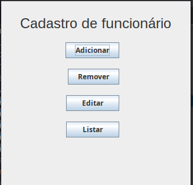
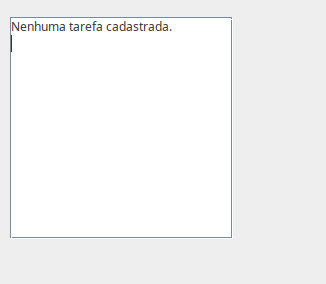
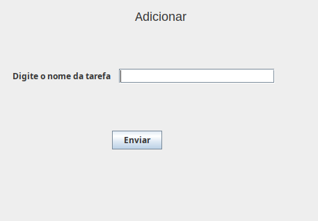
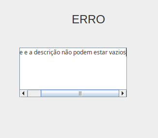

# ☕ Sistema de Gestão de Tarefas

Aplicação em Java com interface gráfica (Swing) desenvolvida para o gerenciamento de tarefas cotidianas, aplicando conceitos de Programação Orientada a Objetos (POO) e manipulação de dados locais.

---

## 💻 Sobre o Projeto

Este projeto tem caráter estritamente **acadêmico e educacional**, criado com o objetivo de praticar o desenvolvimento de interfaces gráficas, estruturação de dados em memória e aplicação de boas práticas de arquitetura em Java.

### ✨ Destaques
- **Pré-cadastro de Dados:** O sistema já inicia com tarefas pré-cadastradas para facilitar os testes das funcionalidades assim que for executado 😃
- **Interface Gráfica (Swing):** Telas para interagir com o sistema de forma simples e intuitiva.
- **Licença:** Desenvolvido por **Luiz Fernando Turela Cordova** sob a licença MIT.

---

## 🚀 Como Executar o Projeto

### Pré-requisitos
* **JDK (Java Development Kit):** Certifique-se de ter o JDK instalado em sua máquina para compilar e executar o código Java.
* **IDE (Ambiente de Desenvolvimento):** Recomendamos o uso de uma IDE Java de sua preferência (NetBeans, IntelliJ IDEA, Eclipse, etc.).

### Passo a Passo
1. Clone este repositório para a sua máquina local:
```bash
git clone https://github.com/fernandotcordova/Sistema-gestao-tarefas.git
```

### Imagens do projeto
- Tela de principal


- Tela de listagem 


- Tela de remoção


- Tela de erro


